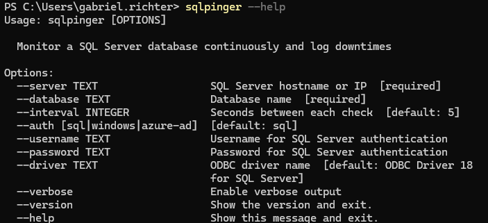

# sqlpinger
A lightweight CLI tool to monitor SQL Server availability by continuously executing WAITFOR DELAY on the database. It automatically detects and logs downtime periods, including total duration and timestamps — and prints a summary report at the end of execution.

Perfect for testing connectivity, diagnosing intermittent issues or validating failovers.

- [Features](#features)
- [Installation](#installation)
- [Usage](#usage)

# Features
- Continuous connection monitoring
- Detects and logs downtime periods
- Smart error grouping (no repeated messages for same errors)
- JSON-formatted summary with total downtime
- Supported authentication method:
  - Azure AD (interactive login)
  - Windows Authentication
  - SQL Authentication
- Works with Azure SQL Database, Azure Managed Instance and on-prem SQL Server

# Installation

## Requirements

- [Python](https://www.python.org/downloads/): >= 3.11

## Via GitHub Releases
You can install this tool by downloading the latest ```.whl``` file from GitHub Releases and using pip.

- Go to the [Releases page](https://github.com/gabrielrih/sqlpinger/releases/).
- Find the latest version and download the ```.whl``` file (Example, ```sqlpinger-1.0.0-py3-none-any.whl```).

Or you can download it from the terminal:

```
wget -O "sqlpinger-1.2.0-py3-none-any.whl" "https://github.com/gabrielrih/sqlpinger/releases/download/v1.2.0/sqlpinger-1.2.0-py3-none-any.whl"
```

- After downloading the .whl file, install it using pip:

```
pip install --user sqlpinger-1.2.0-py3-none-any.whl
```

By doing that a ```sqlpinger.exe``` file will be created probably on the folder: ```C:\Users\user\AppData\Roaming\Python\Python312\Scripts```. So, you must add this folder on the user PATH.

To see the installed version you can run:

```
pip show sqlpinger
```


# Usage
```
sqlpinger \
    --server my-server.database.windows.net \
    --database database-name
```

Available cli parameters ```sqlpinger --help```



## Example output

```
Starting monitor for my-server.database.windows.net/datbase-name every 10s using AzureADInteractive
✅ Connection is healthy
❌ Connection failed: [08S01] ... (error message)
✅ Recovered. Downtime lasted 22s.
```

On Ctrl + C:
```json
{
  "summary": {
    "downtimes_quantity": 1,
    "total_downtime": "22 seconds"
  },
  "downtimes": [
    {
      "from": "2025-05-26 14:42:07",
      "to": "2025-05-26 14:42:29",
      "time": "22 seconds"
    }
  ]
}
```
